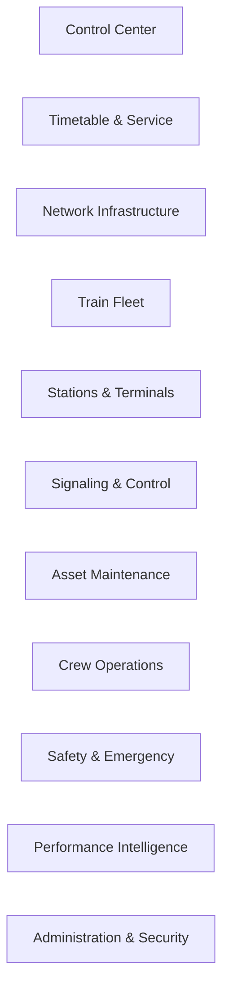
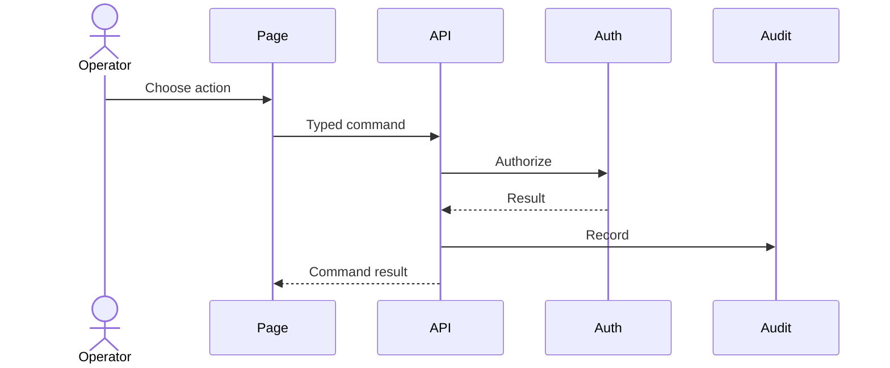
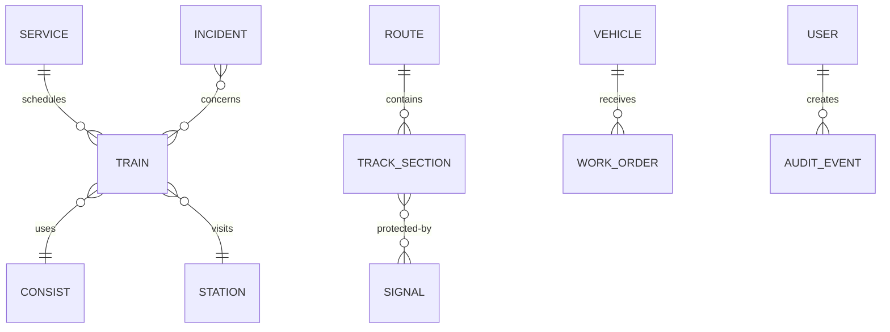

# Railway UML Diagrams

## Module Structure

```mermaid
graph LR
  Control[Control Center]
  Timetable[Timetable & Service]
  Network[Network Infrastructure]
  Fleet[Train Fleet]
  Stations[Stations & Terminals]
  Signals[Signaling & Control]
  Maintenance[Asset Maintenance]
  Crew[Crew Operations]
  Safety[Safety & Emergency]
  Analytics[Performance Intelligence]
  Admin[Administration & Security]
```

## Command Flow

```mermaid
sequenceDiagram
  actor Operator
  participant Page
  participant API
  participant Auth
  participant Audit
  Operator->>Page: Choose action
  Page->>API: Typed command
  API->>Auth: Authorize
  Auth-->>API: Result
  API->>Audit: Record
  API-->>Page: Command result
```

## Entity Relationship

```mermaid
erDiagram
  SERVICE ||--o{ TRAIN : schedules
  TRAIN }o--|| CONSIST : uses
  TRAIN }o--|| STATION : visits
  ROUTE ||--o{ TRACK_SECTION : contains
  TRACK_SECTION }o--o{ SIGNAL : protected-by
  VEHICLE ||--o{ WORK_ORDER : receives
  INCIDENT }o--o{ TRAIN : concerns
  USER ||--o{ AUDIT_EVENT : creates
```
